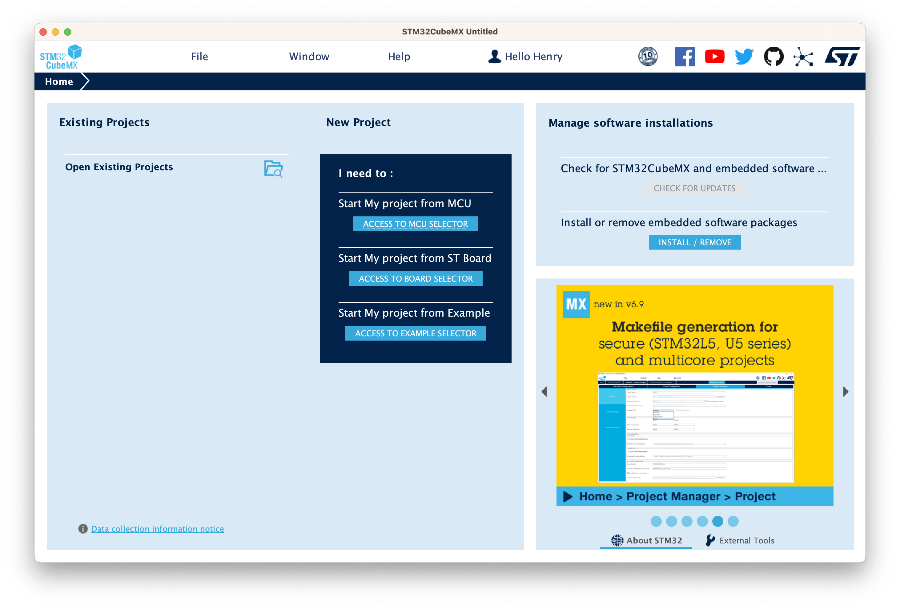
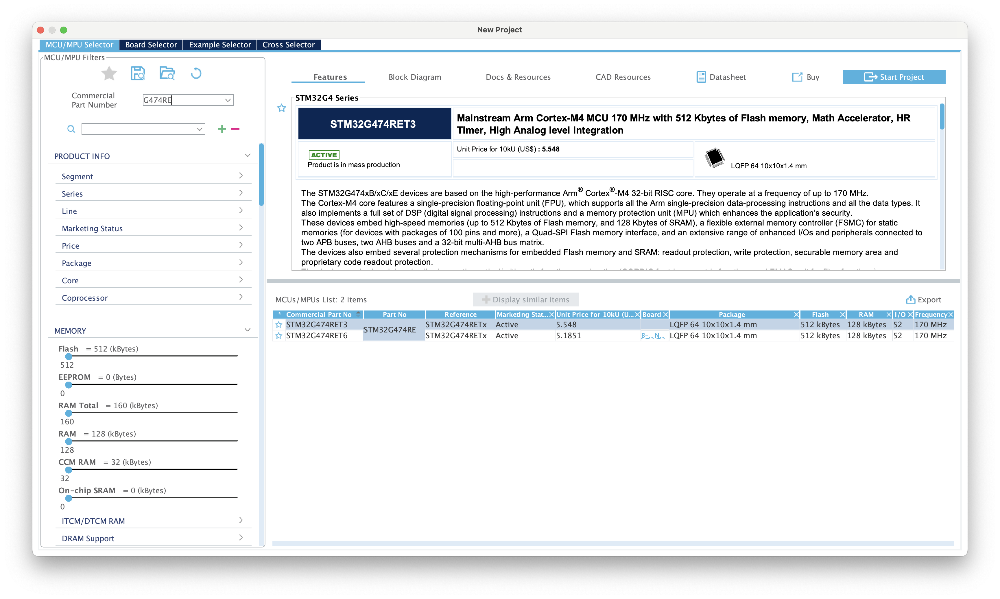
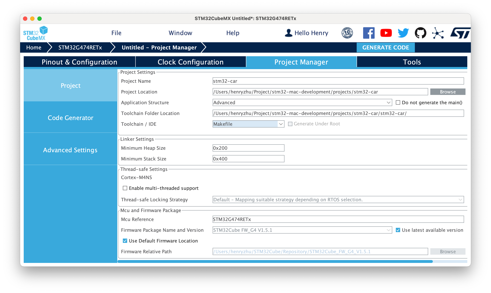

# stm32-mac-development

在 Mac(Apple Silicon) 上开发 STM32 

- [stm32-mac-development](#stm32-mac-development)
  - [配置开发环境](#配置开发环境)
    - [软件安装](#软件安装)
      - [1. STM32Cubemx](#1-stm32cubemx)
      - [2. OpenOCD](#2-openocd)
      - [3. ARM-GCC 工具链](#3-arm-gcc-工具链)
    - [代码环境](#代码环境)
  - [初始化项目](#初始化项目)
  - [项目编译和烧录](#项目编译和烧录)
    - [编译工程](#编译工程)
    - [使用 OpenOCD 烧录到开发板](#使用-openocd-烧录到开发板)
  - [数据](#数据)
  - [参考文章](#参考文章)


## 配置开发环境

### 软件安装

#### 1. STM32Cubemx

STM32Cubemx([官方下载](https://www.st.com/en/development-tools/stm32cubemx.html#get-software)) 是 x86 架构的，在 Apple silicon 上运行需要 rosetta2 的支持。

> 安装时，需要右键 `显示包内容`，然后在 `Contents/MacOS` 点击安装包

#### 2. OpenOCD

[OpenOCD(Open On-Chip Debugger)](https://openocd.org)是一个开源的调试工具([源码](https://sourceforge.net/p/openocd/code/ci/master/tree/))，提供针对嵌入式设备的调试、系统编程和边界扫描功能。但是在 Mac 无法直接使用，因此这里使用一个为 Mac 编译好的 [`xpack-dev-tools/openocd-xpack`](https://github.com/xpack-dev-tools/openocd-xpack)，进入到 [Releases](https://github.com/xpack-dev-tools/openocd-xpack/releases) 中下载 `xpack-openocd-<version>-darwin-arm64.tar.gz`。


解压后添加到环境变量中，这里使用 `~/.zshrc`，添加如下内容：
```shell
export OPENOCD_HOME="/path/to/xpack-openocd-<version>" # openocd
export PATH=$PATH:$OPENOCD_HOME/bin
```

#### 3. ARM-GCC 工具链

[arm-none-eabi-gcc](https://developer.arm.com/downloads/-/gnu-rm) 是一个开源的 ARM 架构的编译器，这里使用 [GNU Arm Embedded Toolchain](https://developer.arm.com/tools-and-software/open-source-software/developer-tools/gnu-toolchain/gnu-rm)。

官方没有提供 Apple Silicon 的版本，因此这里使用一个为 Mac 编译好的项目 [`xpack-dev-tools/arm-none-eabi-gcc-xpack`](https://github.com/xpack-dev-tools/arm-none-eabi-gcc-xpack)，进入到 [Releases](https://github.com/xpack-dev-tools/arm-none-eabi-gcc-xpack/releases) 中下载 `xpack-arm-none-eabi-gcc-<version>-xpack-darwin-arm64.tar.gz`。

解压后添加到环境变量中，这里使用 `~/.zshrc`，添加如下内容：
```shell
export ARM_GCC_HOME="/path/to/xpack-arm-none-eabi-gcc-<version>" # arm-none-eabi-gcc
export PATH=$PATH:$ARM_GCC_HOME/bin
```

### 代码环境


## 初始化项目

1. 创建项目
打开 STM32CubeMX

新建项目 `File -> New Project`



选择芯片(左侧 `Commercial Part Number` 搜索)，然后右上角 `Start Project`


2. 配置项目

- **Pinout&Configuration**: 设置芯片 Pinout 


- **Project Manger -> Project**: 设置项目名称和路径, `Toolchain/IDE` 选择 `Makefile`


- **Project Manger -> Code Generator**: 选择 `Copy only the necessary library files`(不要复制全部库目录，否则项目很大)。勾选 `Generate peripheral initialization as a pair of '.c/.h' files per peripheral`，这样会生成 `.c/.h` 文件，方便查看和修改。


## 项目编译和烧录

### 编译工程
进入到工程目录下，执行 `make`，编译成功后会生成 `build` 目录，包含编译后的文件。该过程会结合 `arm-none-eabi-gcc` 进行编译，具体细节可以查看 `Makefile`。
```shell
arm-none-eabi-size build/stm32-car.elf
   text    data     bss     dec     hex filename
   3564      20    1572    5156    1424 build/stm32-car.elf
arm-none-eabi-objcopy -O ihex build/stm32-car.elf build/stm32-car.hex
arm-none-eabi-objcopy -O binary -S build/stm32-car.elf build/stm32-car.bin
```

### 使用 OpenOCD 烧录到开发板

运行下面的命令，启动 OpenOCD，连接到开发板。
```shell
export openocd_scripts=$OPENOCD_HOME/openocd/scripts
openocd \
    -f $openocd_scripts/interface/stlink.cfg \
    -f $openocd_scripts/target/stm32g4x.cfg

```
> 如果出现 “macos 无法验证“openocd的开发者。你确定要打开它吗？”，到`系统设置 -> 安全性与隐私 -> 通用`，点击“仍要打开”即可。

出现以下内容，表示连接成功，其中可以获得**三种端口连接协议方式(tcl,telnet,gdb)**和其他一些一些信息
- tcl 监听端口：6666
- telnet 监听端口：4444
- gdb 监听端口：3333 (调试功能使用)
- 时钟频率：2000 kHz
```shell
xPack Open On-Chip Debugger 0.12.0-01004-g9ea7f3d64-dirty (2023-01-30-17:03)
Licensed under GNU GPL v2
For bug reports, read
        http://openocd.org/doc/doxygen/bugs.html
Info : auto-selecting first available session transport "hla_swd". To override use 'transport select <transport>'.
Info : The selected transport took over low-level target control. The results might differ compared to plain JTAG/SWD
Info : Listening on port 6666 for tcl connections
Info : Listening on port 4444 for telnet connections
Info : clock speed 2000 kHz
Info : STLINK V3J9M3 (API v3) VID:PID 0483:374E
Info : Target voltage: 3.285220
Info : [stm32g4x.cpu] Cortex-M4 r0p1 processor detected
Info : [stm32g4x.cpu] target has 6 breakpoints, 4 watchpoints
Info : starting gdb server for stm32g4x.cpu on 3333
Info : Listening on port 3333 for gdb connections
```

保持上述连接的状态下，在另一个终端中，启动  `telnet`，连接到 OpenOCD
```shell
telnet localhost 4444
# 连接成功后，输入
> halt  # 目标芯片挂起，相当于关机
# > flash write_image erase <需要烧写的目标文件>
> flash write_image erase build/stm32-car.bin
> reset # 目标芯片复位
```

也可以一次性执行
```shell
export openocd_scripts=$OPENOCD_HOME/openocd/scripts
openocd \
    -f $openocd_scripts/interface/stlink.cfg \
    -f $openocd_scripts/target/stm32g4x.cfg \
    -c init \
    -c "reset halt; wait_halt; flash write_image erase build/stm32-car.bin 0x08000000;" \
    -c "reset run; shutdown"
```
- `-c` 表示要执行的选项， `init` 初始化
- `wait_halt` 是等待目标芯片挂起，必须有


## 数据
[STM32G474RE](https://www.st.com/zh/microcontrollers-microprocessors/stm32g474re.html)


## 参考文章

- [跟我一起学OpenOCD](https://zhuanlan.zhihu.com/p/41517198)

