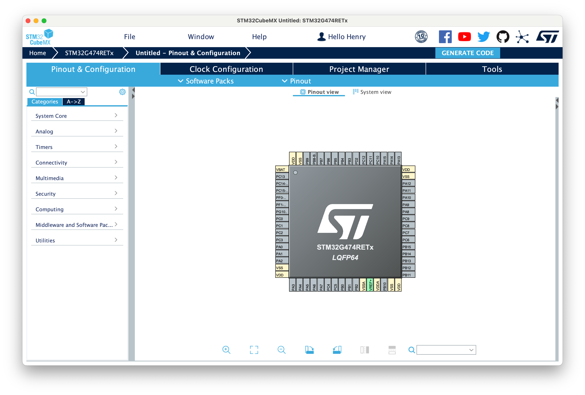

# stm32-mac-development

在 Mac(Apple Silicon) 上开发 STM32 

- [stm32-mac-development](#stm32-mac-development)
  - [配置开发环境](#配置开发环境)
    - [软件安装](#软件安装)
      - [1. STM32Cubemx](#1-stm32cubemx)
      - [2. OpenOCD](#2-openocd)
      - [3. ARM-GCC 工具链](#3-arm-gcc-工具链)
    - [代码环境](#代码环境)
  - [初始化项目](#初始化项目)
  - [参考文章](#参考文章)


## 配置开发环境

### 软件安装

#### 1. STM32Cubemx

STM32Cubemx([官方下载](https://www.st.com/en/development-tools/stm32cubemx.html#get-software)) 是 x86 架构的，在 Apple silicon 上运行需要 rosetta2 的支持。

> 安装时，需要右键 `显示包内容`，然后在 `Contents/MacOS` 点击安装包

#### 2. OpenOCD

[OpenOCD(Open On-Chip Debugger)](https://openocd.org)是一个开源的调试工具([源码](https://sourceforge.net/p/openocd/code/ci/master/tree/))，提供针对嵌入式设备的调试、系统编程和边界扫描功能。但是在 Mac 无法直接使用，因此这里使用一个为 Mac 编译好的 [`xpack-dev-tools/openocd-xpack`](https://github.com/xpack-dev-tools/openocd-xpack)，进入到 [Releases](https://github.com/xpack-dev-tools/openocd-xpack/releases) 中下载 `xpack-openocd-<version>-darwin-arm64.tar.gz`。


解压后添加到环境变量中，这里使用 `~/.zshrc`，添加如下内容：
```shell
export OPENOCD_HOME="/path/to/xpack-openocd-<version>" # openocd
export PATH=$PATH:$OPENOCD_HOME/bin
```

#### 3. ARM-GCC 工具链

[arm-none-eabi-gcc](https://developer.arm.com/downloads/-/gnu-rm) 是一个开源的 ARM 架构的编译器，这里使用 [GNU Arm Embedded Toolchain](https://developer.arm.com/tools-and-software/open-source-software/developer-tools/gnu-toolchain/gnu-rm)。

官方没有提供 Apple Silicon 的版本，因此这里使用一个为 Mac 编译好的项目 [`xpack-dev-tools/arm-none-eabi-gcc-xpack`](https://github.com/xpack-dev-tools/arm-none-eabi-gcc-xpack)，进入到 [Releases](https://github.com/xpack-dev-tools/arm-none-eabi-gcc-xpack/releases) 中下载 `xpack-arm-none-eabi-gcc-<version>-xpack-darwin-arm64.tar.gz`。

解压后添加到环境变量中，这里使用 `~/.zshrc`，添加如下内容：
```shell
export ARM_GCC_HOME="/path/to/xpack-arm-none-eabi-gcc-<version>" # arm-none-eabi-gcc
export PATH=$PATH:$ARM_GCC_HOME/bin
```

### 代码环境


## 初始化项目

1. 创建项目
打开 STM32CubeMX

新建项目 `File -> New Project`


选择芯片(左侧 `Commercial Part Number` 搜索)，然后右上角 `Start Project`


2. 配置项目

- **Pinout&Configuration**: 设置芯片 Pinout 


- **Project Manger -> Project**: 设置项目名称和路径, `Toolchain/IDE` 选择 `Makefile`


- **Project Manger -> Code Generator**: 选择 `Copy only the necessary library files`(不要复制全部库目录，否则项目很大)。勾选 `Generate peripheral initialization as a pair of '.c/.h' files per peripheral`，这样会生成 `.c/.h` 文件，方便查看和修改。


## 参考文章

- [跟我一起学OpenOCD](https://zhuanlan.zhihu.com/p/41517198)

